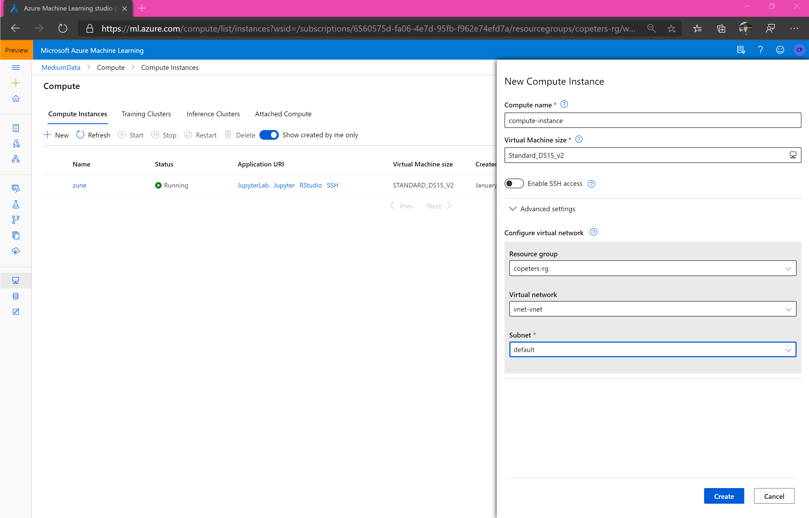
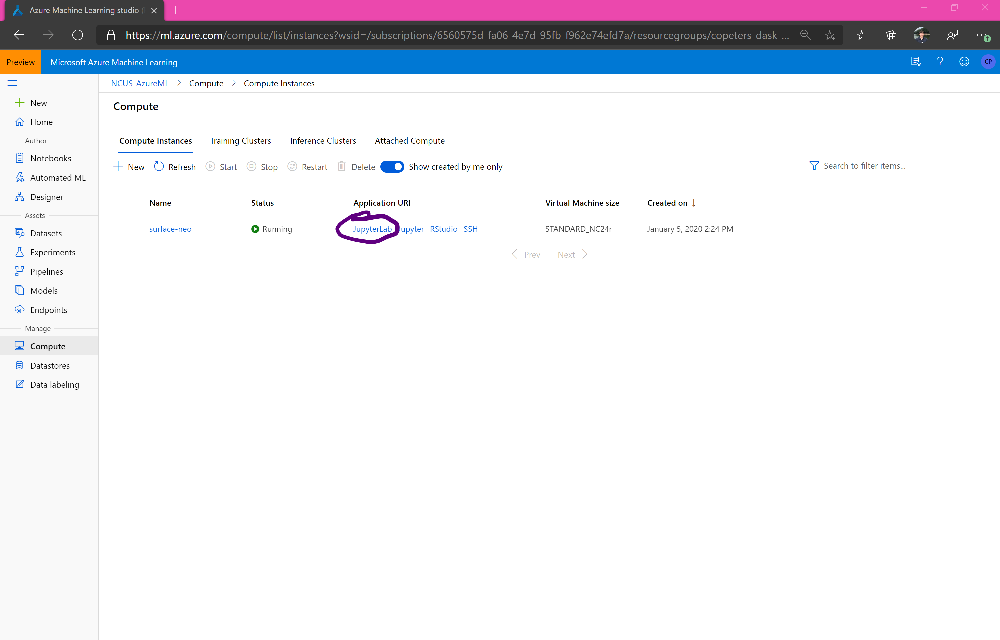
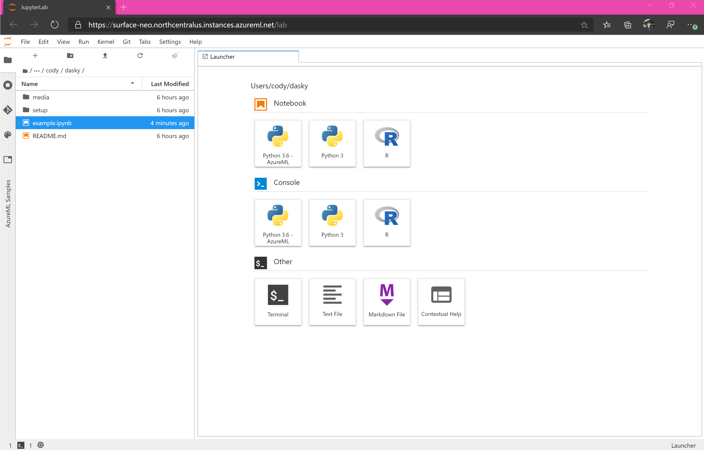

forked from https://github.com/danielsc/azureml-and-dask

# Azure ML and Dask 

## Introduction

Dask is awesome. Azure ML is cool too. 

## Data overview

The data is hosted at https://data4dask.dfs.core.windows.net/datasets/noaa/isd. It is a copy of the [NOAA Integrated Surface Data (ISD)](https://azure.microsoft.com/services/open-datasets/catalog/noaa-integrated-surface-data/) moved from [Azure Open Dataset](https://azure.microsoft.com/services/open-datasets/catalog/) to a ADLS Gen 2 filesystem for distributed processing. 

Expanded in a dataframe in memory, the full dataset is ~660 GB. It is stored in compressed parquet files partitioned by year and month. The dataset is **not** updated in the ADLS Gen 2 storage account, but is in the Azure Open Dataset. Compressed, the files for the dataset are ~8 GB. Uncompressed, the files for the dataset are ~150-200 GB.  

The parition format is `year=*/month=*/part-*.snappy.parquet` with 1 file per month. Each file can contain ~5 GB of data when in a dataframe in memory. Compressed, each file is ~50 MB. Uncompressed, each file is ~1 GB. 

## Create a virtual network 

Create or use an existing virtual network (vNET). Both the interface for the Dask cluster and the cluster itself will be in the virtual network. You can quickly create one in the [Azure Portal](https://docs.microsoft.com/en-us/azure/virtual-network/quick-create-portal) or [Azure CLI](https://docs.microsoft.com/en-us/azure/virtual-network/quick-create-cli) if you do not have one already.

In the `example.ipynb` notebook, the vNET is assumed to be in the same resource group as the workspace with a name 'dialup-network' and subnet 'default'. 

## Create and setup compute instance 

Create an Azure ML Compute Instance in the vNET you have created.

**Important**: Your workspace must be in *North Central US* or *UK South* due to Compute Instance availability.

**Important**: The size of your Compute Instance will affect the amount of data you can run on 'locally' with Dask. I find a `STANDARD_DS15_V2` works well for ~1 year of data, while a `STANDARD_NC24` works well for ~2 years of data. Adjust the size of data in the notebook as needed for your VM size. In this example, using a GPU machine is wasteful since we are not using the GPUs. Dask can be configured to use GPUs - an example of this is "in progress". 

**Important**: Enabling SSH access is optional and not recommended, despite the misleading screenshot below.

**Warning**: With default subscription quotas, you will not be able to run the notebook as-is. Check your subscription's quota in the region and calculate the maximum size cluster you can use. The default cluster created in this notebook is about the minimum needed to work with the data very quickly without repartitioning the data, but smaller clusters will work. Do not persist the dataframe on smaller clusters, this will harm performance.

## Launch JupyterLab or Jupyter

Launch JupyterLab (recommended) or Jupyter from the list of URIs. 

## Clone repository

You can use the terminal or UI to clone https://github.com/lostmygithubaccount/dasky.git.

## Repository overview

