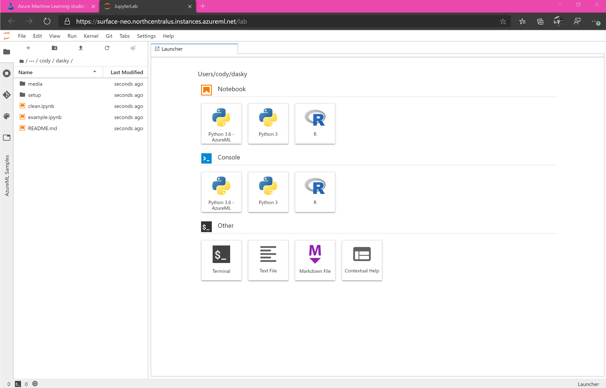

# Azure ML and Dask 

## Introduction

Dask is awesome. Azure ML is cool too. 

## Create a virtual network 

Create or use an existing virtual network (vNET). Both the interface for the Dask cluster and the cluster itself will be in the virtual network. You can quickly create one in the [Azure Portal](https://docs.microsoft.com/en-us/azure/virtual-network/quick-create-portal) or [Azure CLI](https://docs.microsoft.com/en-us/azure/virtual-network/quick-create-cli) if you do not have one already.

In the `example.ipynb` notebook, the vNET is assumed to be in the same resource group as the workspace with a name 'dialup-network' and subnet 'default'. 

## Create and setup compute instance 

Create an Azure ML Compute Instance in the vNET you have created.

Enabling SSH access is optional.

## Launch JupyterLab or Jupyter

Launch JupyterLab (recommended) or Jupyter from the list of URIs. 

## Clone git repo

Navigate to a directory of your choice and clone repo from github. 

You can use the terminal or UI to clone the repo, hosted at https://github.com/lostmygithubaccount/dasky.git. Copy this link and clone the repo.

## Repository overview

## Data overview

The data is hosted at https://data4dask.dfs.core.windows.net/datasets/noaa. It is a copy of an Azure Open Dataset moved to a ADLS Gen 2 filesystem for distributed processing. 
