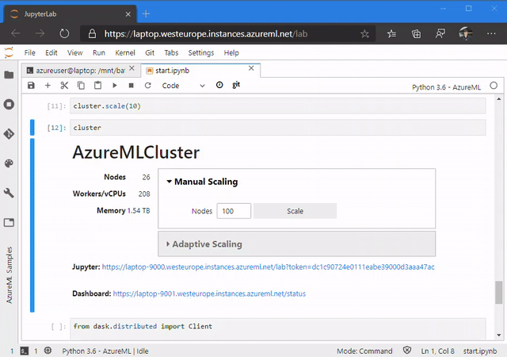

forked from https://github.com/danielsc/azureml-and-dask

# Azure ML and Dask 


## Introduction
Dask + Azure ML = OSS Data Science & ML @ Scale.

## This repo
`AzureMLCluster` makes it easy to setup a powerful Dask cluster for interactive work:
```python
from azureml.core import Workspace
from dask_cloudprovider import AzureMLCluster

ws = Workspace.from_config()
cluster = AzureMLCluster(ws)
```



You can follow the link to view the Dask dashboard. You can also use an interactive JupyterLab session on the cluster, with all or some mountable Azure ML Datastores from your Workspace available on the headnode via standard POSIX file system. You can manage the Azure ML Environment, including base docker image and conda/pip packages, which will be used on the cluster. 

Clusters can be created on most Azure ML VM sizes, including commodity CPU machines for large distributed clusters or high-performance GPU machines.

## How to run
You can connect to the `AzureMLCluster` through a Compute Instance (CI) on a Virtual Network (vNET) or local via port forwarding.

If you are using a vNET with a Compute Instance, see [this example](ci-on-vnet/01.start-cpu-cluster.ipynb) for getting started.

>Note: there is a known issue with the Dask dashboard not working on a compute instance. If you need the dashboard, it is recommended to use the local setup. 

If you are running from local, see [this example](local/01.start-cpu.ipynb).

>Note: there is a known issue running from the Windows Subsystem for Linux (WSL).
