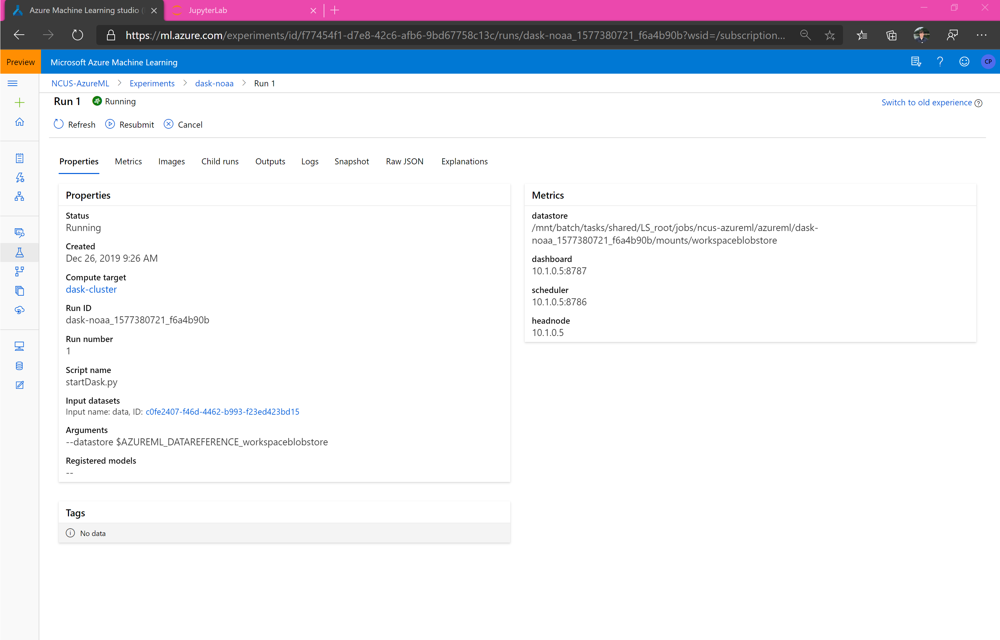
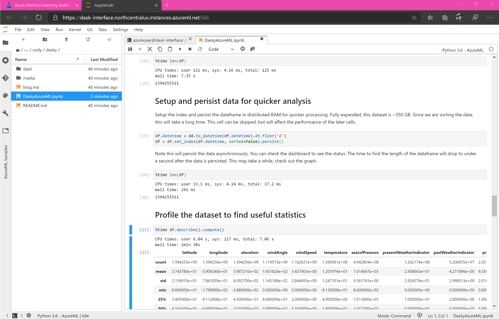
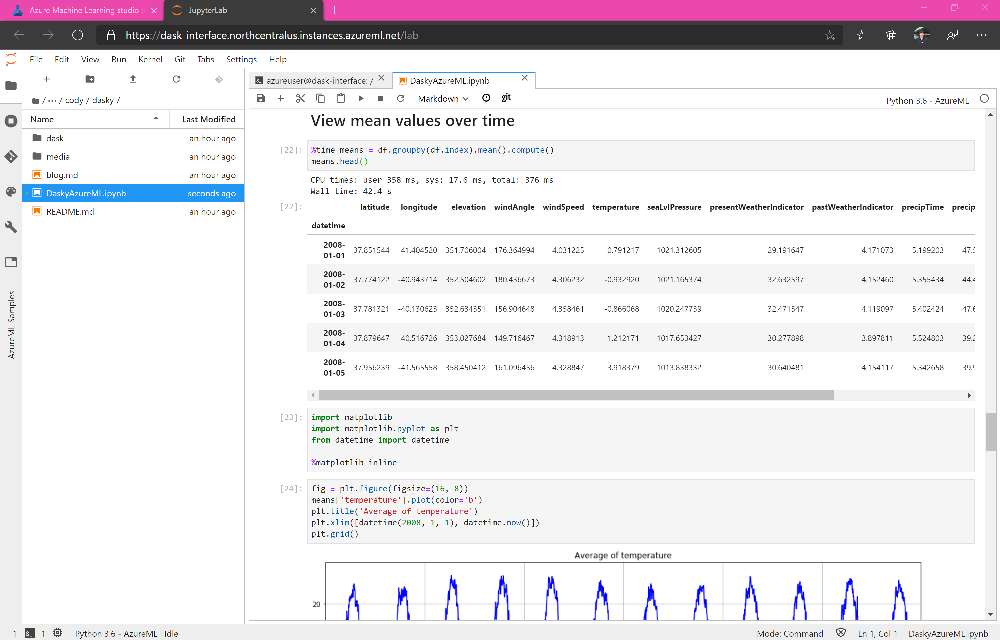

# Fun with Azure ML and Dask 

## Titles under consideration

Stashing titles here. Keep thinking of good ones and forgetting them. 

* Terabyte-scale data preparation using dask
* Fun with Azure ML and Dask
* Terabyte-scale data preparation using Pandas (sorta...)
* Scale up Pandas and Scikit-Learn with Dask and Azure ML

## Introduction

blah blah blah

## Create a virtual network 

Create (or use an existing) virtual network. Both the interface for the Dask cluster and the cluster itself will be in the virtual network. You can quickly create one in the [Azure Portal](https://docs.microsoft.com/en-us/azure/virtual-network/quick-create-portal) or [Azure CLI](https://docs.microsoft.com/en-us/azure/virtual-network/quick-create-cli) if you do not have one already.

In the git repo associated with this blog, the VNET is assumed to be in the same resource group as the workspace with a name 'dask-vnet' and subnet 'default'. 

## Create and setup compute instance 

Create an Azure ML Compute Instance in the VNET you have created. The Virtual Machine (VM) size is unimportant for this blog as it is simply being used as an interface to the Dask cluster and hosting code in the cloud. 

Enabling SSH access is optional.

## Launch JupyterLab or Jupyter

Launch JupyterLab (recommended) or Jupyter from the list of URIs. 

## Clone git repo

Clone the Azure ML and Dask example repo from github. 

You can use the terminal or UI to clone the repo, hosted at https://github.com/lostmygithubaccount/dask-examples.git. Copy this link and clone the repo.

## Overview of repository 

Open up `DaskyAzureML.ipynb`. Start the run. This will take a few minutes, depending on whether a new image needs to be built and other factors. You can read through the overview of what the setup incurs below while waiting for the cluster to setup. 

## Overview of assets 

First, we create an Azure ML VM pool, or "Training cluster". You can see this in the studio. This pool will scale between 0 and 100 nodes as jobs are submitted to it. 

Then, we create an Azure ML Dataset from an Azure Open Dataset. You can see this in the studio. 

Then, we create an Experiment and submit a Run to it. 

In the run, we can see details and metrics/other assets logged to the run.

Wait until the cluster is setup before proceeding. The run will be in the 'Running' state and information about the cluster (headnode, scheduler, etc.) will be logged as metrics to the run. These can be seen either in the Jupyter widget or the Azure ML studio.

## Connect to the cluster

Connect to the cluster through the Dask Client. 

## Exploring the data

## Preparing the data 

## Writing to a dataset 

## Conclusion 

## Troubleshooting 
