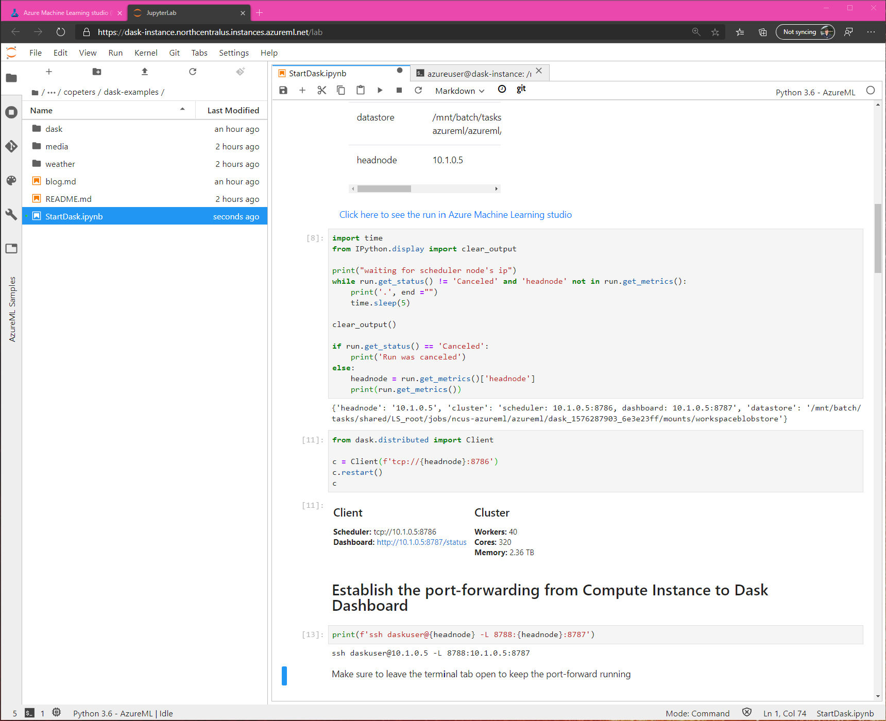

# Fun with Azure ML and Dask 

## Introduction

blah blah blah

## Create cluster and compute instance


## Setup cluster

In a notebook:

```python
from azureml.core import Workspace, Experiment
from azureml.widgets import RunDetails
from azureml.core.runconfig import RunConfiguration, MpiConfiguration
from azureml.train.estimator import Estimator

ws = Workspace.from_config()
ct = ws.compute_targets['dask-cluster']

est = Estimator('dask', 
                compute_target=ct, 
                entry_script='startDask.py', 
                conda_dependencies_file='environment.yml', 
                script_params={'--datastore': ws.get_default_datastore()},
                node_count=50,
                distributed_training=MpiConfiguration())

run = Experiment(ws, 'dask').submit(est)

RunDetails(run).show()
```


## Connect to cluster

Start the cluster

```python
from dask.distributed import Client

c = Client(f'tcp://{headnode}:8786)
c
```

Optionally, run the output of the following in a terminal on the compute instance:

```python
print(f'ssh daskuser@{headnode} -L 8788:{headnode}:8787')
```

You will need the password you setup for the SSH account on the cluster. This will forward the Dask dashboard bokeh app to the compute instance. You can access it at `https://{compute_instance}-8788.{region}.instances.azureml.net/status`. For example, with my compute instance named `dask-instance` in region `northcentralus` the link https://dask-instance-8788.northcentralus.instances.azureml.net/status works.



Wow, a cluster with 2.3 TB of memory and 320 cores!!! This is where the fun begins.

## Getting data

Let's get some data.

## Exploring the data

