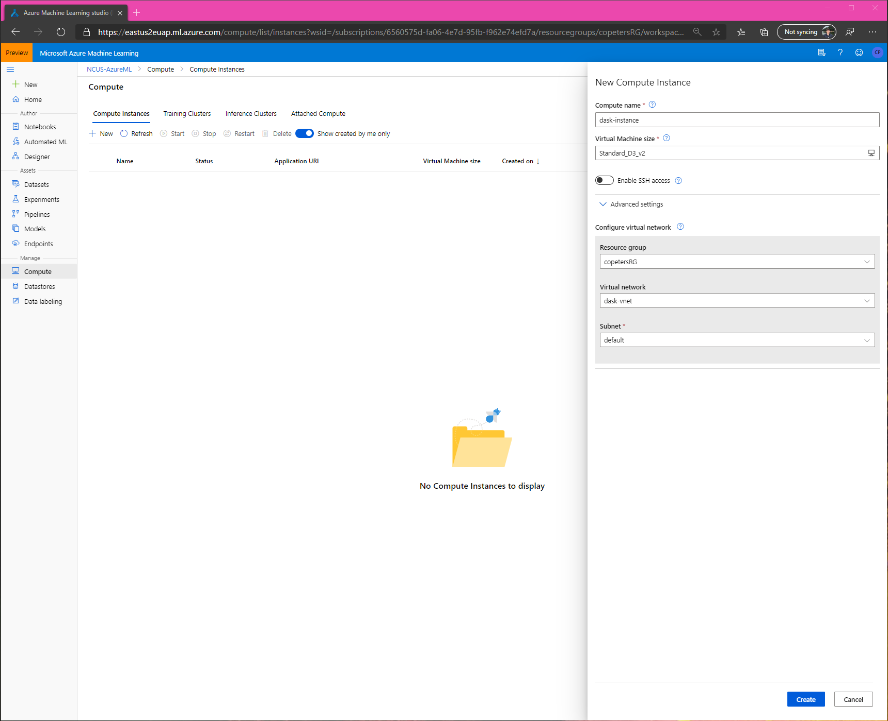
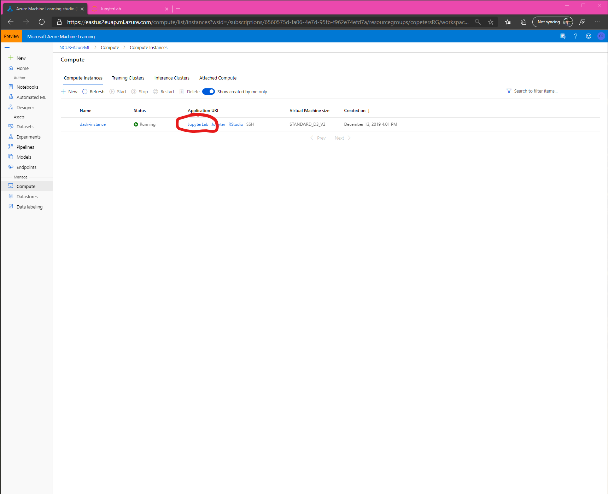
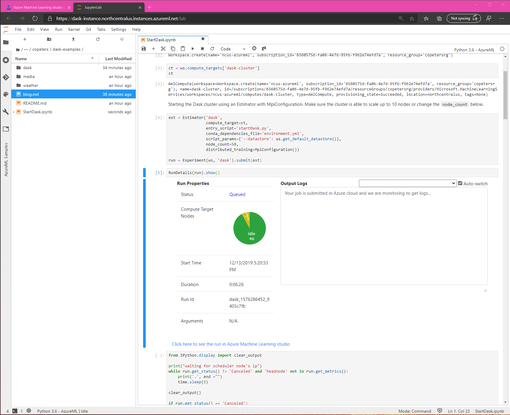

# Fun with Azure ML and Dask 

## Introduction

blah blah blah

## Create cluster and compute instance







## Setup cluster

In a notebook:

```python
from azureml.core import Workspace, Experiment
from azureml.widgets import RunDetails
from azureml.core.runconfig import RunConfiguration, MpiConfiguration
from azureml.train.estimator import Estimator
```

then:

```python
ws = Workspace.from_config()
ws
```

then:

```python
ct = ws.compute_targets['dask-cluster']
ct
```

then:

```python
est = Estimator('dask', 
                compute_target=ct, 
                entry_script='startDask.py', 
                conda_dependencies_file='environment.yml', 
                script_params={'--datastore': ws.get_default_datastore()},
                node_count=50,
                distributed_training=MpiConfiguration())

run = Experiment(ws, 'dask').submit(est)
```

then:

```python
RunDetails(run).show()
```



## Connect to cluster

```python
from dask.distributed import Client

c = Client(f'tcp://{headnode}:8786)
c
```

## Getting data

## Exploring the data

