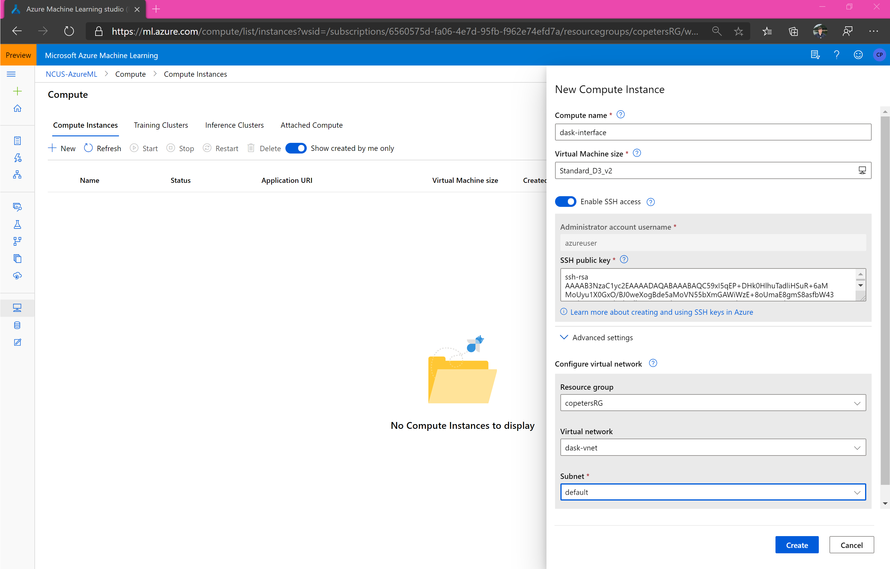
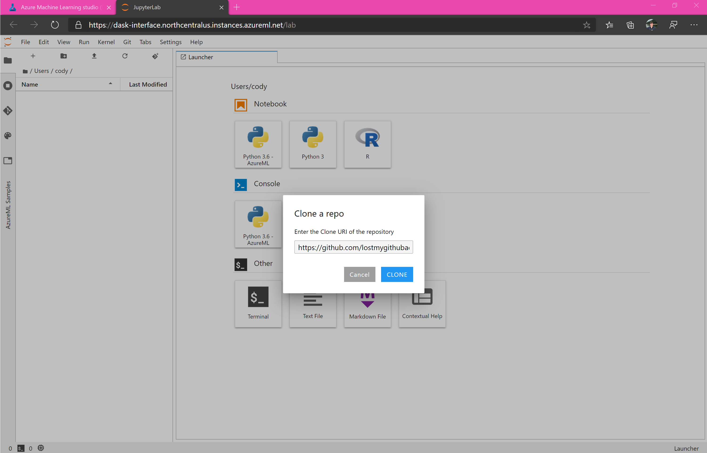
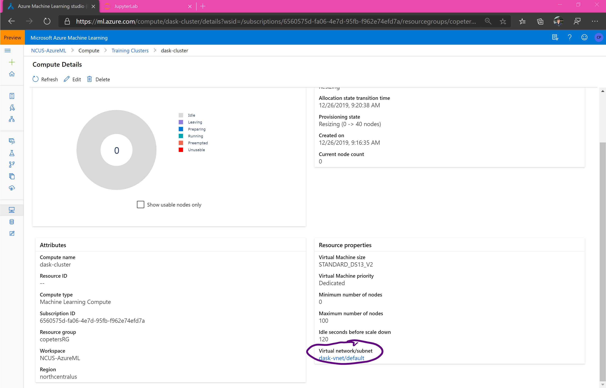
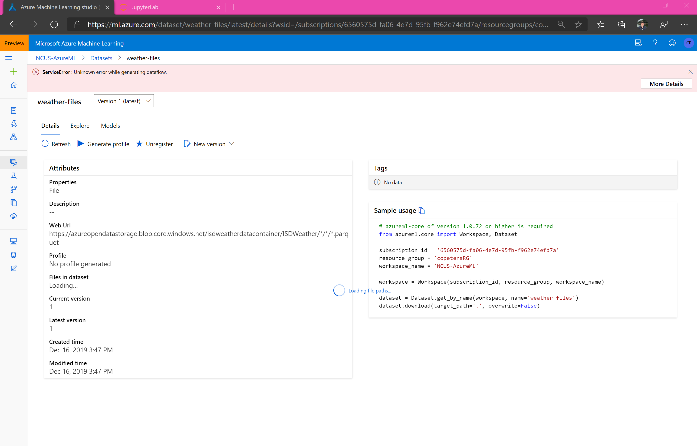
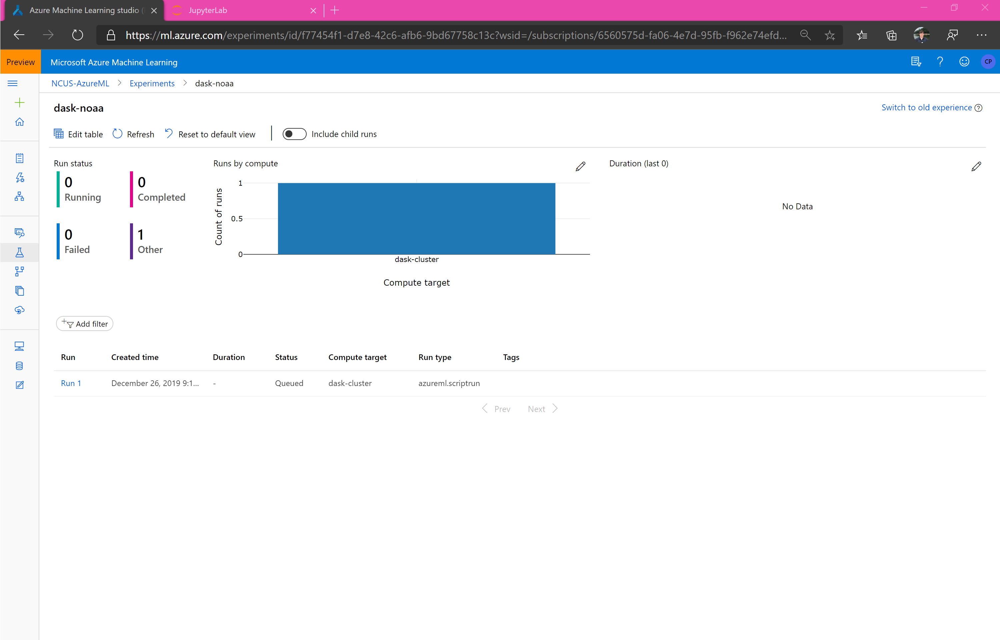
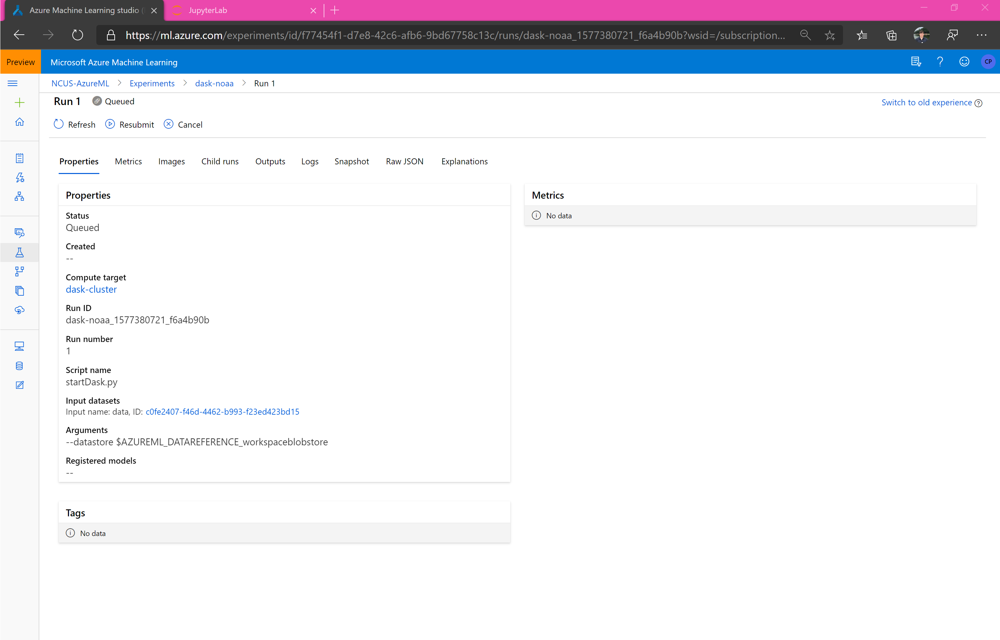

# Fun with Azure ML and Dask 

## Titles under consideration

Stashing titles here. Keep thinking of good ones and forgetting them. 

* Terabyte-scale data preparation using dask
* Fun with Azure ML and Dask
* Terabyte-scale data preparation using Pandas (sorta...)
* Scale up Pandas and Scikit-Learn with Dask and Azure ML

## Introduction

blah blah blah

## Create a virtual network 

Create (or use an existing) virtual network. Both the interface for the Dask cluster and the cluster itself will be in the virtual network. You can quickly create one in the [Azure Portal](https://docs.microsoft.com/en-us/azure/virtual-network/quick-create-portal) or [Azure CLI](https://docs.microsoft.com/en-us/azure/virtual-network/quick-create-cli) if you do not have one already.

In the git repo associated with this blog, the VNET is assumed to be in the same resource group as the workspace with a name 'dask-vnet' and subnet 'default'. 

## Create and setup compute instance 

## Launch JupyterLab or Jupyter

## Clone git repo

If using JupyterLab, click on the button to clone a git repo. The repo we will clone is hosted at https://github.com/lostmygithubaccount/dask-examples.git. Copy this link and clone the repo. 

## Overview of repository 

Open up `StartDask.ipynb`. 

## Overview of assets 

First, we create an Azure ML VM pool, or "Training cluster". You can see this in the studio.

Then, we create an Azure ML Dataset from an Azure Open Dataset. You can see this in the studio. 

Then, we create an Experiment and submit a Run to it. 

## Exploring the data

## Preparing the data 

## Writing to a dataset 

## Conclusion 

## Troubleshooting 
