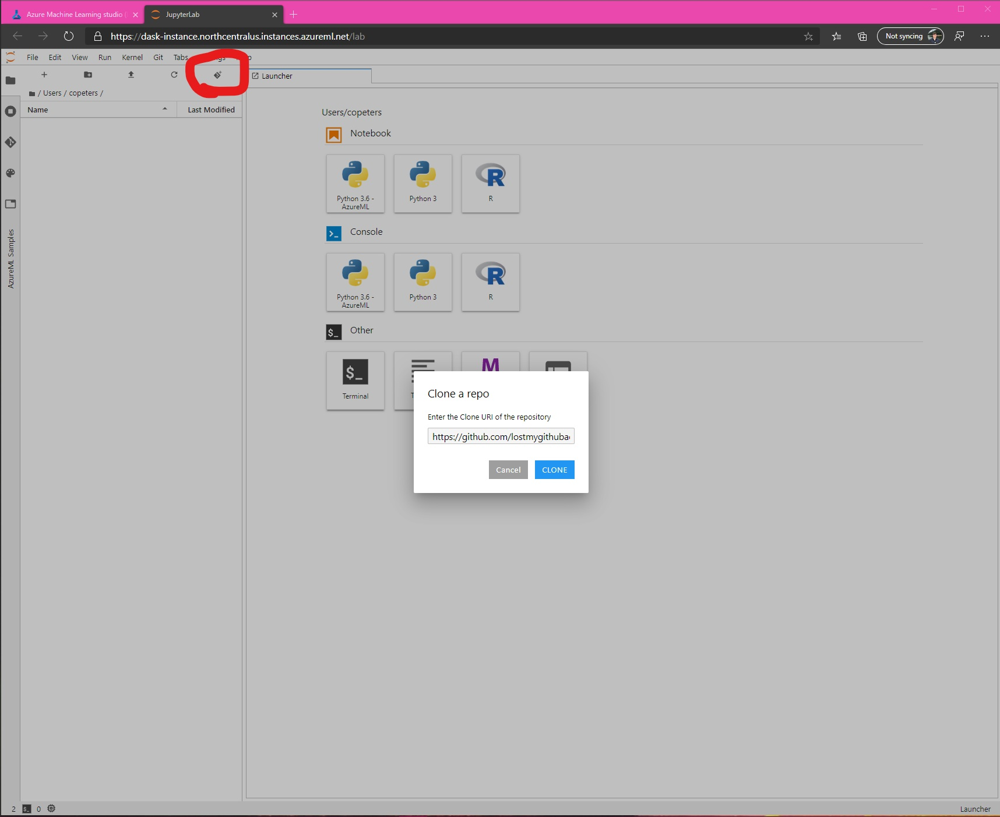

# Fun with Azure ML and Dask 

## Introduction

blah blah blah

## Create cluster and compute instance

We will create an Azure ML compute cluster and compute instance. The instance will be our interface with the cluster, where we will set it up and send it commands through a Jupyter notebook. Both will be placed in the same Azure virtual network. If you do not already have a virtual network, you can [easily create one](https://docs.microsoft.com/azure/virtual-network/quick-create-portal#create-a-virtual-network) using default settings. Having both the Jupyterlab interface and dask cluster in the same virtual network allows for easy connection between the two and increased security through firewalls and other features. 

First, let's setup the Azure ML cluster. It is recommended to use `STANDARD_DS12_v2` or similar sized. For this example, I'll use a cluster with 20 nodes. Make sure to configure the cluster in the virtual network and create a username and password/SSH key as shown below. The login information will be used to setup port forwarding between the instance and the cluster, which is optional but highly recommended to connect to the dask dashboard. You do not need to enable port 22. 


Next, let's setup the compute instance. Since this compute will not be doing much work, any size machine is fine. Again, make sure to place it in the same virtual network as the cluster. This will take a few minutes to create and setup. 


Once ready, you will have a link to open JupyterLab (recommended) or Jupyter. Click one of the links.


If using JupyterLab, click on the button to clone a git repo. The repo we will clone is hosted at https://github.com/lostmygithubaccount/dask-examples.git. Copy this link and clone the repo. 



Open up `StartDask.ipynb`. 

## Setup cluster

The following code will import Azure ML dependencies for connecting to a workspace, creating an experiment, and setting up a run. If you are unfamiliar with these terms, please visit [the documentation](https://docs.microsoft.com/en-us/azure/machine-learning/service/concept-azure-machine-learning-architecture#workspaces). It is split over the first few cells in `StartDask.ipynb`. 

```python
from azureml.core import Workspace, Experiment
from azureml.widgets import RunDetails
from azureml.core.runconfig import RunConfiguration, MpiConfiguration
from azureml.train.estimator import Estimator

ws = Workspace.from_config()
ct = ws.compute_targets['dask-cluster']

est = Estimator('dask', 
                compute_target=ct, 
                entry_script='startDask.py', 
                conda_dependencies_file='environment.yml', 
                script_params={'--datastore': ws.get_default_datastore()},
                node_count=50,
                distributed_training=MpiConfiguration())

run = Experiment(ws, 'dask').submit(est)

RunDetails(run).show()
```

A widget will appear showing the status of the run. It may take a few minutes for the cluster to scale up, set up, and be ready for use. When ready, you'll see `headnode`, `cluster`, and others logged to the run. At this point, the cluster is ready to use.  

In the provided notebook, the cell below this step will wait for the run to have `headnode` logged to it before proceeding. This needs to be ready before we can connect to the cluster. 


## Connect to cluster

To connect to the cluster, simply setup a Dask client connecting to the headnode we logged. Since we are in the same virtual network, no port forwarding or other setup is needed. 

```python
from dask.distributed import Client

c = Client(f'tcp://{headnode}:8786)
c
```


Wow, a cluster with 2.3 TB of memory and 320 cores!!! This is where the fun begins.

## Connect to the dask dashboard

However, to access the Dask dashboard, we do need to establish port forwarding from the headnode to the compute instance. To do this (highly recommended), you can run the output of the following in a terminal on the compute instance:

```python
print(f'ssh daskuser@{headnode} -L 8788:{headnode}:8787')
```

You will need the password you setup for the SSH account on the cluster. This will forward the Dask dashboard bokeh app to the compute instance. You can access it at `https://{compute_instance}-8788.{region}.instances.azureml.net/status`. For example, with my compute instance named `dask-instance` in region `northcentralus` the link https://dask-instance-8788.northcentralus.instances.azureml.net/status works.

## Getting data

Let's get some data.

## Exploring the data

## Preparing the data 

## Writing to a dataset 

## Conclusion 
